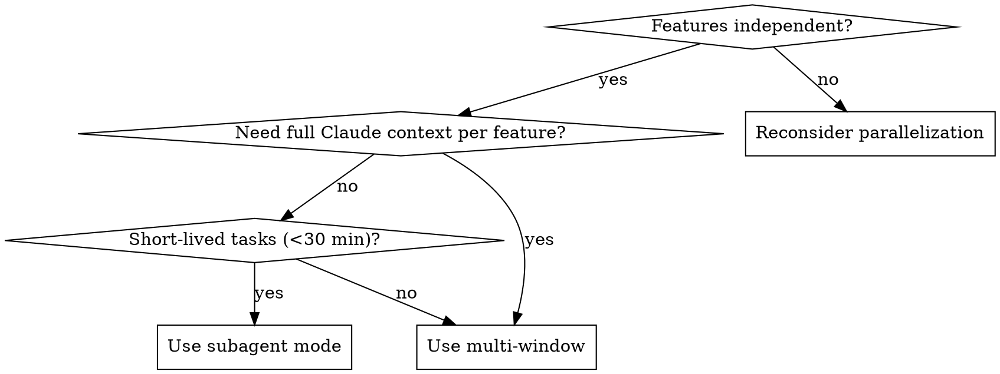

# Parallel Worktree Session

## Overview

One branch. One worktree. One agent. This is the core constraint that makes parallel development work without file conflicts, port collisions, or context pollution between features.

**Core principle:** Spin up isolated workspaces first, coordinate after.

## Phase 1 — Plan: Feature Decomposition

Before creating anything, define what you're parallelizing:

1. List features — name each by what it does, not how
2. Verify independence — features that modify the same files are NOT good candidates
3. Choose execution mode (see decision table below)
4. Build a tracking table:

| Feature | Branch | Worktree Path | Mode | Port |
|---------|--------|---------------|------|------|
| `myapp-auth` | `feature/auth` | `.worktrees/auth` | multi-window | 3001 |
| `myapp-payments` | `feature/payments` | `.worktrees/payments` | multi-window | 3002 |

**Naming convention:** `{project}-{feature-slug}` — e.g., `myapp-auth`, `api-rate-limiting`

### Multi-Window vs Subagent Mode



| | Multi-Window | Subagent Mode |
|---|---|---|
| **Isolation** | Full — separate Claude processes | Shared parent context |
| **Best for** | Long-running features, deep context | Parallel tasks, batch work |
| **Setup** | `cd <path> && claude` per window | Task tool dispatch |
| **Max concurrent** | 4-5 (coordination cost rises beyond) | Bounded by Task concurrency |

## Phase 2 — Spin Up

**REQUIRED SUB-SKILL:** Use `superpowers:using-git-worktrees` for each feature. That skill handles: directory selection, `.gitignore` verification, dependency setup, and baseline test verification.

**Multi-window mode** — after each worktree is created, open a new terminal per feature:
```bash
cd .worktrees/auth && claude
cd .worktrees/payments && claude
```

**Subagent mode** — dispatch via Task tool:
```
Task("Implement auth feature in worktree at .worktrees/auth on branch feature/auth.
     Goal: [specific acceptance criteria]
     Constraints: Do not modify files outside src/auth/
     Return: Summary of changes and test results")
```

**Port offset rule:** Stagger dev servers to avoid conflicts:
- Main: 3000, Feature 1: 3001, Feature 2: 3002

## Phase 3 — Track

Run this to see worktree status at a glance:

```bash
git worktree list
```

**Conflict risk check** — detect if two worktrees touched the same file:
```bash
# Compare changes in two worktrees against main
git -C .worktrees/auth diff main --name-only > /tmp/auth-files.txt
git -C .worktrees/payments diff main --name-only > /tmp/payments-files.txt
comm -12 <(sort /tmp/auth-files.txt) <(sort /tmp/payments-files.txt)
```

**Sync cadence:** At the start of each session, pull main into each active worktree:
```bash
git -C .worktrees/auth pull origin main
```

> Worktrees that drift >1 week from main accumulate merge conflicts exponentially. Sync daily on active work.

## Phase 4 — Merge

**REQUIRED SUB-SKILL:** Use `superpowers:finishing-a-development-branch` per feature when ready.

**Merge order matters** when multiple features finish close together:
1. Run the conflict check from Phase 3 first
2. Merge the feature with **fewer shared files** first
3. After first merge, re-run conflict check against updated main before merging second feature
4. If both features modified the same file: resolve before either merge

## Phase 5 — Cleanup

After each feature is merged/discarded:

```bash
# ALWAYS use this — never rm -rf a worktree directory
git worktree remove .worktrees/auth

# After all removals, prune stale metadata
git worktree prune
```

**Safety check before removing:**
```bash
git -C .worktrees/auth status  # Must show clean working tree
git -C .worktrees/auth log origin/main..HEAD  # Must show no unpushed commits
```

> Manual `rm -rf` on a worktree corrupts git's internal metadata. `git worktree remove` updates `.git/worktrees/` correctly.

## Quick Reference

| Phase | Command |
|-------|---------|
| List worktrees | `git worktree list` |
| Add worktree | `git worktree add .worktrees/auth -b feature/auth` |
| Sync with main | `git -C .worktrees/auth pull origin main` |
| Conflict check | `comm -12 <(sort auth-files.txt) <(sort payments-files.txt)` |
| Safe remove | `git worktree remove .worktrees/auth` |
| Prune metadata | `git worktree prune` |

## Common Mistakes

| Mistake | Fix |
|---------|-----|
| Same port for all dev servers | Offset: 3001, 3002, 3003 |
| Checking out same branch in two worktrees | Each worktree requires a unique branch |
| `rm -rf` on worktree directory | Always use `git worktree remove` |
| Letting worktrees drift weeks from main | Pull main at session start |
| Merging without conflict check | Run file overlap check before second merge |
| >5 concurrent worktrees | Coordination cost exceeds parallelization benefit |

## Integration

**Delegates to:**
- **`superpowers:using-git-worktrees`** — Phase 2: single worktree creation with safety checks
- **`superpowers:finishing-a-development-branch`** — Phase 4: merge/PR/cleanup per feature
- **`superpowers:dispatching-parallel-agents`** — Subagent dispatch pattern for Phase 2

**Called by:**
- `superpowers:brainstorming` — when approved design splits into parallel implementation tracks
- `superpowers:dispatching-parallel-agents` — when tasks require filesystem isolation
