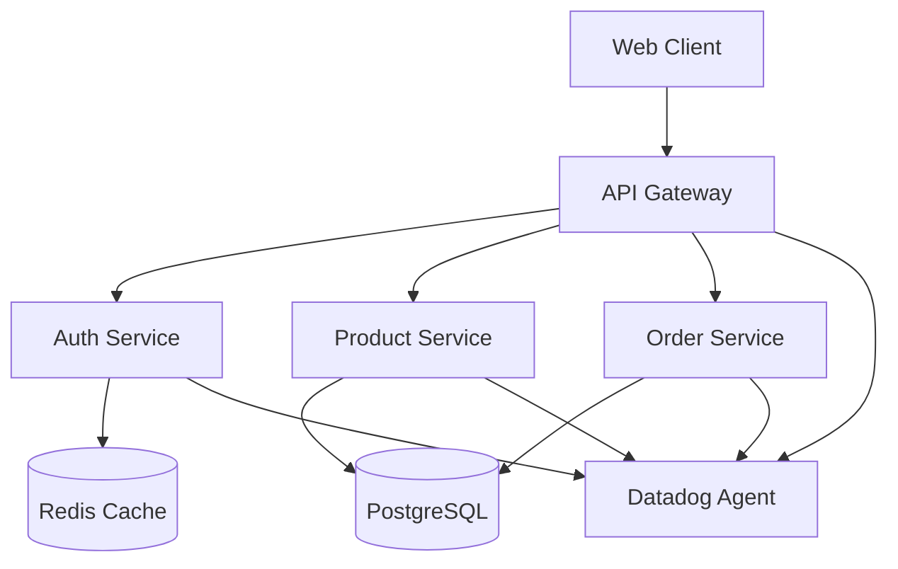
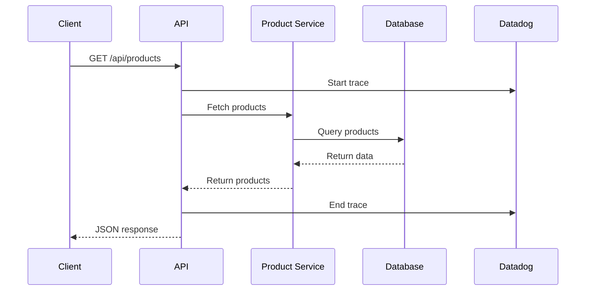

# Architecture Documentation & Mermaid Diagrams

## Architecture Doc Generator

```python
class ArchitectureDocGenerator:
    def __init__(self, project_path: str):
        self.project_path = Path(project_path)

    def generate_architecture_doc(self) -> str:
        """Generate system architecture documentation"""
        components = self.analyze_components()

        doc = f"""
# System Architecture

## Overview
{self.generate_system_overview()}

## Components
{self.format_components(components)}

## Data Flow
{self.generate_data_flow_diagram()}

## API Design
{self.document_api_design()}

## Database Schema
{self.document_database_schema()}

## Monitoring & Observability
{self.document_monitoring_setup()}

## Deployment Architecture
{self.document_deployment_architecture()}
        """
        return doc.strip()
```

## System Diagram (Mermaid)



## Sequence Diagram (Mermaid)


